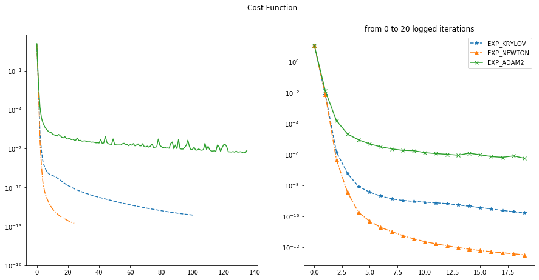
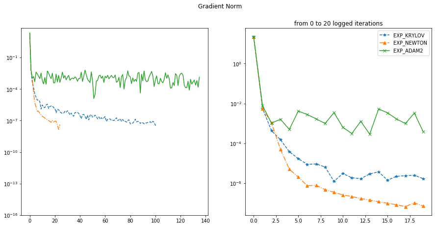
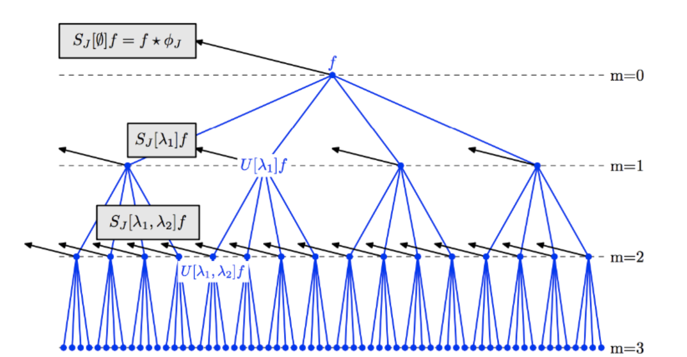

## Research @ NYU Center For Data Science
### Symplectic Integration of Dynamical System with Neural Network
#### Learn more: [https://github.com/ChengTang/SymplecticNetwork](https://github.com/ChengTang/SymplecticNetwork)



I came up with a framework for learning to integrate Hamiltonian Dynamics through unsupervised learning(where we have access only to the Hamiltonian) and supervised learning(where we have access to data). See above for examples of learned dynamics of 

1. a non-separable Hamiltonian 

2. a mass-spring system with 10 particles

3. a 2D mass-spring system with 6 particles

4. a spring-pendulum system with 2 degrees of freedom

5. a 2D spring-mass system with 8 particles

Symplecticity is built into the architecture of the neural network using the idea of Normalizing Flow and symplectic transformation, and the dynamic of a particular Hamiltonian system is learned through minimizing the loss function that encodes the physics of the Hamiltonian system. 

In the supervised learning setting, the Hamiltonian(or, the physics) of a dynamical system is learned, and one could retrieve the dynamics using symplectic integrators like leapfrog: it is related to the Hamiltonian neural network and the series of work that follows it.

---
### Scalable Second Order Method for Non-Convex Optimization
#### Learn more: [https://github.com/ChengTang/Krylov_NeuralNet](https://github.com/ChengTang/Krylov_NeuralNet)

This is a study of optimization algorithms for extremely ill-conditioned, non-convex regression problem where small optimization error is desired. A scalable second order method based on Krylov iteration that attacks the saddle point problem is found to out-perform all of the popular first order methods(e.g. gradient descent, Adam, ...) and many other scalable alternatives(e.g. quasi-Newton methods, conjugate gradient method). 

The plots above compares performance of the Krylov based method with ADAM and the full Newton method(where full Hessian is needed and factorized; a O(N^3) algorithm) on a toy regression problem. The Krylov based method with full reorthogonalization has complexity O(k^2 N) and has both fast convergence and scalability.

Runtime & iteration of the three algorithms:

1. **Krylov: 2575 seconds, 10,000 iterations**
2. **Newton: 4320 seconds, 2000 iterations**
3. **ADAM: 7629 seconds, 5,000,000 iterations**

The Tensorflow implementation of the second order method using Krylov subspace method can be found in the link above. 

---

## Projects @ NYU

### Fast CUDA Kernel for Scattering Invariant Convolutional Neural Network
#### Learn more: [https://github.com/ChengTang/HPC_SP19_project](https://github.com/ChengTang/HPC_SP19_project)

Wrote GPU acclerated kernels for scattering-invariant convolutional network in C++, as my High Performance Computing class project. Parallelized scattering transformation for feature extraction from batches of image data. Mostly an engineering project.
